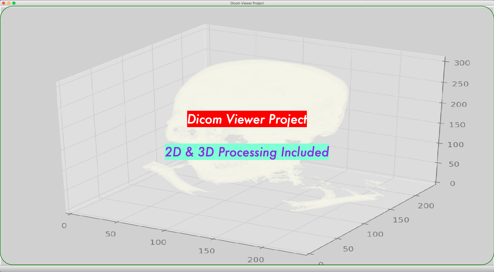
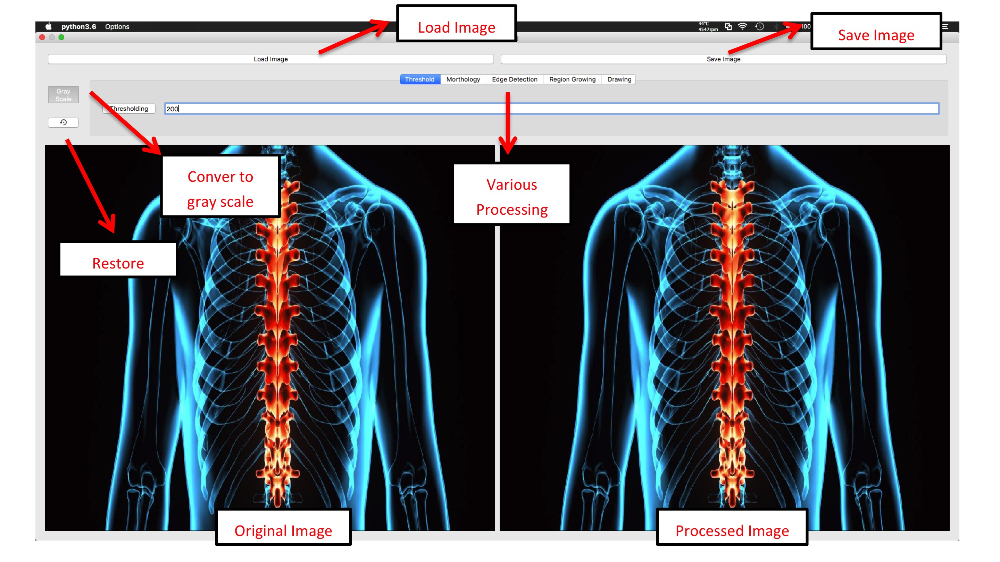
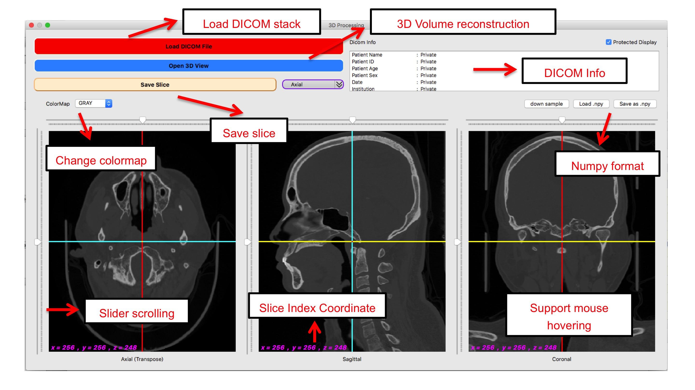
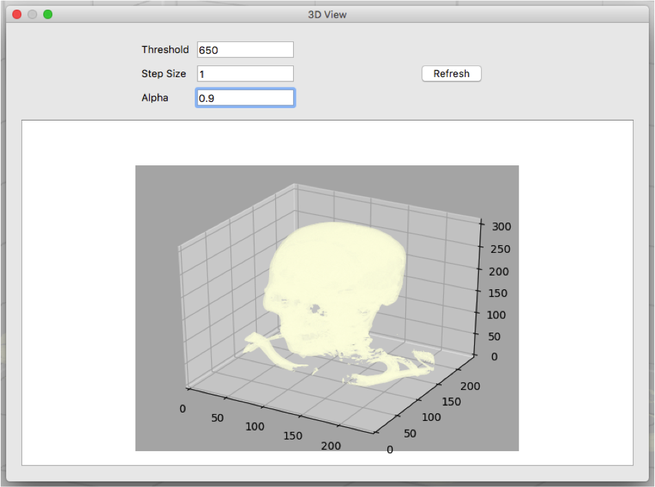

  
  <h2 align="center">簡易醫學影像GUI (Dicom Viewer)</h2>
  
能顯示 2D/3D Dicom影像的應用

   

本project旨在利用python+Qt製作簡易的醫學影像GUI，提供一個平台，能在上面使用python開發測試各式影像處理功能，尤其是針對3D之Dicom Stack！

## 先看兩段Demo吧
###  <a href="https://www.youtube.com/watch?v=TOXczNnnZ4c&feature=youtu.be">2D Image Processing</a>
### <a href="https://www.youtube.com/watch?v=NS75AQOVOss&feature=youtu.be">3D Image Processing</a>
  
## 執行畫面
執行程式會打開Main Window，左上角的選單有2D processing和3D processing兩個子選項，其中後者embed有3D volume reconstruction功能

### Main Window

### 2D processing
內含功能
- Load Image (含*.dcm)
- Save Image
- Convert to gray scale
- Restore
- Thresholding
- Region Growing
- Morthology (Dilation, Erosion, Opening, Closing)
- Edge Detection (Laplacian, Sobel, Perwitt, Frei & Chen)
- Drawing
 

### 3D processing
內含功能
- Load DICOM stack
- Save slice (axial, sagittal, coronal)
- Colormap transform
- Slider scrolling
- Mouse hovering/clicking
- Show DICOM info
- Show slice index coordinate
- 3D volume reconstruction
 

### 3D volume reconstruction
 

## Future Extension
- 加入數據分析功能
    >導入一些醫學知識，讓軟體有一些初步的分析功能（如有沒有骨折、腫瘤等等）
- 3D reconstruction改善
    >更新volume重建算法，提升計算速度與還原度
- 3D image processing
    >加入對3D voxel影像進行更複雜的影像處理功能
- Make it distributable
    >包裝成release版本，成為可轉散發軟體。希望能支援跨平台運作（window、macOS）
    
## How to use it?
Project root will be **/src**, just clone it and run mainwindow.py.

Strictly follow the package version in requirements.txt is not necessary.

## Acknowledgments
- [brain.png](https://github.com/wenyalintw/Dicom-Viewer/blob/master/resources/brain.png) licensed under "CC BY 3.0" downloaded from [ICONFINDER](https://www.iconfinder.com/icons/1609653/brain_organs_icon) 
- 3D volumn reconstruction modified from [Howard Chen's Post](https://www.raddq.com/dicom-processing-segmentation-visualization-in-python/)

###### MIT License (2019), Wen-Ya Lin